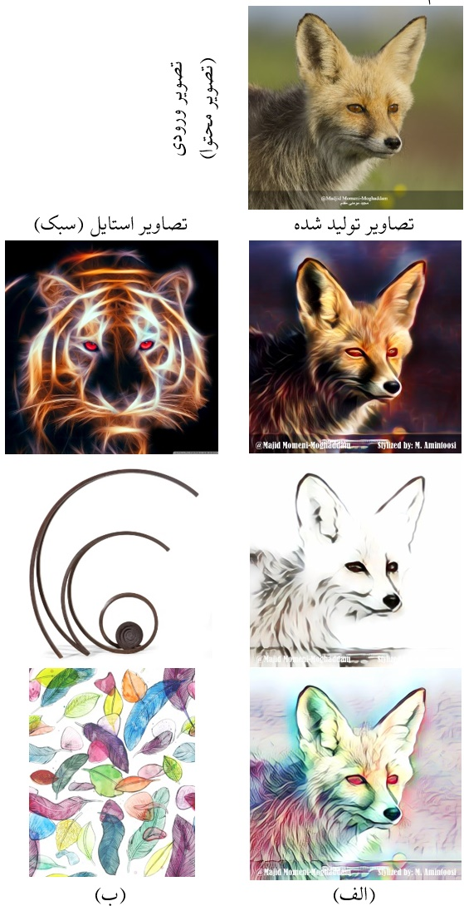

<div dir="rtl">
برخی از نتایج و کدهای مرتبط با مقاله‌ی ارسالی زیر:

## انتقال سبک برای افزایش داده‌های آموزشی شبکه‌های کانولوشنی در شناسایی شعله‌ی آتش

چکیده:<br>
وجود داده‌های آموزشی کافی، امری اساسی در همه‌ی سیستم‌های یادگیری بانظارت و منجمله در حوزه‌ی یادگیری عمیق و بینایی ماشین است. یکی از روش‌های مورد استفاده برای افزایش تعداد نمونه‌های آموزشی در یادگیری عمیق، شیوه‌ی «داده افزایی» هست. این شیوه، متضمن  تبدیل‌های دوران، انتقال و برش بر روی تصاویر آموزشی است که منجر به افزایش تعداد نمونه‌های آموزشیِ نسبتاً متفاوت از داده‌های اولیه می‌گردد. در این نوشتار از الگوریتم «انتقال سَبْک» مبتنی بر شبکه‌های مولد رقابتی برای افزایش تعداد نمونه‌های آموزشی استفاده شده است. هدف در انتقال سبک، اِعمال ظاهر یا سبک بصری یک تصویر بر روی تصویری دیگر است که جنبه‌ی هنری آن  بیشتر دیده شده است. در این نوشتار از این شیوه‌ برای تولید نمونه‌های جدید آموزشی استفاده شده و به عنوان یک کاربرد، روش پیشنهادی بر روی مسأله‌ی شناسایی شعله‌ی آتش اعمال شده است. با این فرض که تصاویر آموزشی ثبت شده در طی شب، کمتر از نمونه‌های اخذ شده در روز هستند،  با اعمال یک روش انتقال سبک، تصاویر روز به تصاویر شب تبدیل شده و به عنوان داده‌ی آموزشی به مجموعه دادگان اضافه می‌شوند. نتایج آزمایشات انجام شده کارایی شیوه‌ی پیشنهادی را نشان داده است. به صورت میانگین، نرخ درست شناسایی ۴ درصد افزایش یافته است. 

در ادامه برنامه‌ی آموزش شبکه و برخی از شکل‌های مقاله، تصاویر دیگر مرتبط که به علت حجم زیاد در مقاله نیامده‌اند و  را ملاحظه خواهیم کرد.
## اجرای برنامه در گوگل کولب

برای اجرای برنامه در گوگل کولب از لینک زیر استفاده کنید.
به لحاظ ماهیت تصادفی مقداردهی اولیه‌ی وزنهای شبکه‌های عصبی، روال آموزش شبکه، خصوصیات سرور تخصیص داده شده و ... نتایج در اجراهای مختلف مقداری متفاوت خواهد بود. یک اجرای کامل برنامه حدود ۳ ساعت طول کشیده و نزدیک به ۶۰۰ مگابایت داده و مدل دانلود یا تولید خواهد شد. هیچ داده‌ای روی دستگاه شما ذخیره نخواهد شد و همه عملیات روی سرورهای گوگل انجام می‌شود.
</div>

https://colab.research.google.com/github/mamintoosi/ST-for-DA-in-FD/blob/master/train_fire_net_main.ipynb

<div dir="rtl">
توضیحات مختصر مربوط به آموزش مدل یا استفاده از مدل‌های از قبل آموزش داده شده در برنامه فوق درج شده است.

### اعمال انتقال سبک یک تصویر بر روی تصویر دیگر:
شکل ۱ مقاله:
<table  align="center" border="1">
<tr><td>  </td><td> سطر اول: تصویر روباه، به عنوان تصویر محتوا. در سطرهای بعد، ستون (الف) نتیجه اعمال 
<a href="https://github.com/sunshineatnoon/LinearStyleTransfer">
شیوه‌ی انتقال سبک عصبی زیر است
</a>
 که تصویر روباه سطر اول به عنوان تصویر محتوا و تصویر سطر مربوطه در ستون (ب) به عنوان تصویر استایل درنظر گرفته شده بوده‌اند.
نمونه‌هایی متاثر از استایل‌های دیگر را می‌توانید در 
<a href="https://github.com/mamintoosi/MMM-Artistic-photoes">
اینجـــــــا
</a>
 ملاحظه فرمایید.
 </td></tr>
</table>
</div>

```
@inproceedings{li2018learning,
    author = {Li, Xueting and Liu, Sifei and Kautz, Jan and Yang, Ming-Hsuan},
    title = {Learning Linear Transformations for Fast Arbitrary Style Transfer},
    booktitle = {IEEE Conference on Computer Vision and Pattern Recognition},
    year = {2019}}
```
<div dir="rtl">

### تبدیل تصاویر روز به تصاویر شب

با استفاده از 
<a href="https://github.com/mamintoosi-papers-codes/TSIT">
روش انتقال سبک عصبی زیر
</a>، ۸۵ تصویر روز به شب تبدیل شدند:
</div>

```
@inproceedings{jiang2020tsit,
  title={{TSIT}: A Simple and Versatile Framework for Image-to-Image Translation},
  author={Jiang, Liming and Zhang, Changxu and Huang, Mingyang and Liu, Chunxiao and Shi, Jianping and Loy, Chen Change},
  booktitle={ECCV},
  year={2020}}
```
<div dir="rtl">
نمونه تصاویری از صحنه‌های روز که به شب تبدیل شده‌اند:
<table  align="center" border="1">
<tr><td>تصــــویر حاصل از انتقــــال سبـــک </td><td> تصــــــــویــــــــــــر استــــــــــــایـــــل </td><td>تصــــــــــویـــــر محــــتـــوای ورودی</td></tr>
</table>
<table  align="center" border="1">
<tr><td>  </td></tr>
<tr><td>  </td></tr>
</table>
سایر تصاویر  را می‌توانید در 
<a href="https://raw.githack.com/mamintoosi/ST-for-DA-in-FD/main/images/day2night.html">
اینجـــــــا
</a>
 ملاحظه فرمایید.

برنامه‌ی مربوطه را می‌توانید از آدرس زیر اجرا کنید:
</div>
https://colab.research.google.com/github/mamintoosi-papers-codes/TSIT/blob/master/day2night_fire.ipynb

<div dir="rtl">

### بخشی از نتایج شناسایی با دو مدل Aug-Scale و Aug-D2N-Scale

<table  align="center" border="1">
<tr><td> مدل Aug-Scale: داده‌افزایی با تغییراندازه و برش تصویر </td><td> مدل پیشنهادی Aug-D2N-Scale: داده‌افزایی با تبدیل روز به شب و تغییراندازه و برش تصویر  </td></tr>
<tr><td></td><td></td></tr>
<tr><td></td><td></td></tr>
<tr><td></td><td></td></tr>
<tr><td></td><td></td></tr>
<tr><td></td><td></td></tr>
<tr><td></td><td></td></tr>
<tr><td></td><td></td></tr>
<tr><td></td><td></td></tr>
<tr><td></td><td></td></tr>
<tr><td></td><td></td></tr>
<tr><td></td><td></td></tr>
<tr><td></td><td></td></tr>
<tr><td></td><td></td></tr>
<tr><td></td><td></td></tr>
<tr><td></td><td></td></tr>
</table>

</div>

